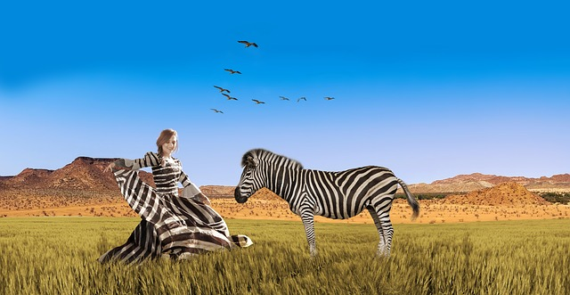
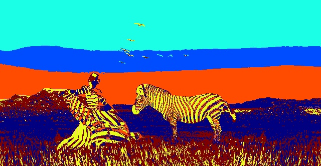
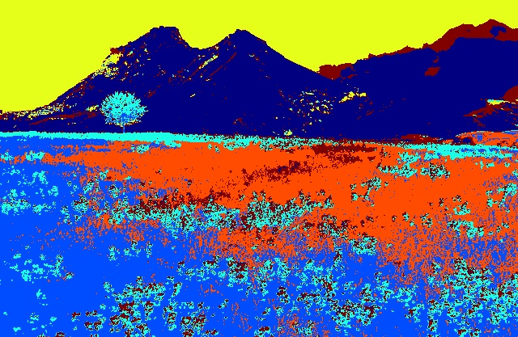
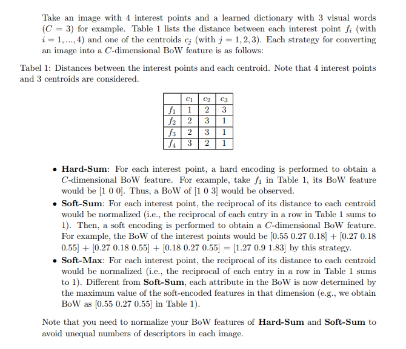
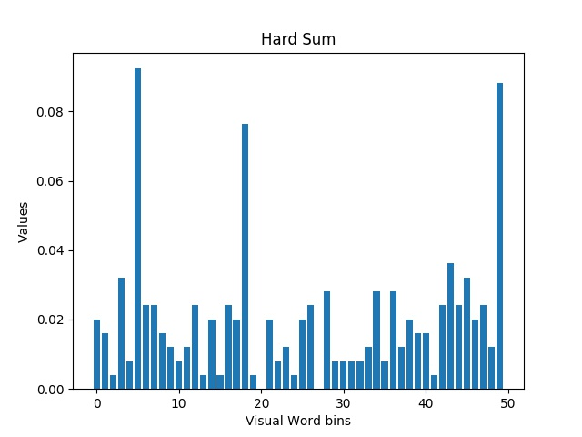
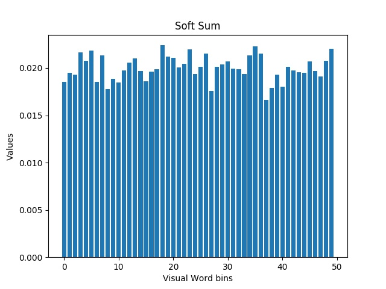
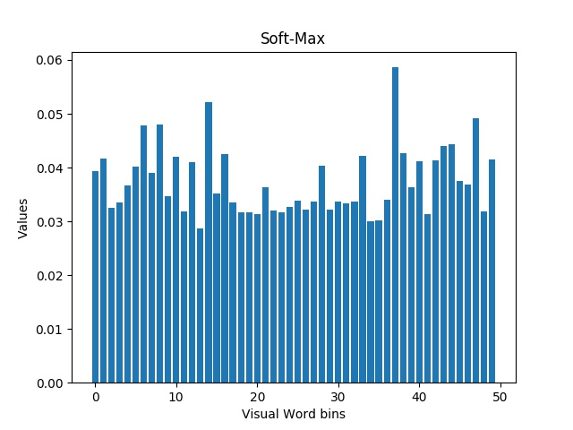

# Lab_2 

This is the simplified version of NTU Deep Learning for Computer Vision (DLCV) course HW2.

**What you will learn :**
- Color Segmentation
- Texture Segmentation
- Feature Descriptor
- Recognition with Bag of Visual Words


**Directory Tree**
```
|__Lab2
|  |__ Readme.md
|  |__ train-100/
|  |__ test-100/
|  |__ image/
|  |__ filterBank.mat
|  |__ mountain.jpg
|  |__ zebra.jpg
```

**Requirement**

You can only use the python packages below:

 - numpy
 - cv2 (opencv)
 - matplotlib
 - sklearn
 - scipy  ( only  for reading .mat file or compute distance, eg. `scipy.spatial.distance.euclidean()`)

## 1. Color & Texture Segmentation

   
### Image data and filter banks
-	**filterBank.mat** :  The given .mat file contains a set of 38 filters. This filter bank is stored as a 49x49x38 matrix.
-	**Images** :  *zebra.jpg* and *mountain.jpg*

### Problems

1. **Color Segmentation** :    Given an RGB color image of size n = w × h pixels, each pixel can be viewed as a three dimensional feature. For this task, please run the **k-means** clustering algorithm* to cluster these n pixels (in terms of their 3D features) into k groups. 
	
	(*Use k=10 and maximum number of iterations = 1000)

	**(a)**. Plot the segmentation results for both images based on your clustering results.For visualization purposes, pixels in the same group should be represented by the same color, while those in different groups are shown in distinct colors, as shown above. Some tips are shown in **hint 1** below. 

	[zebra_RGB.jpg],[mountain_RGB.jpg]
	
	**(b)** Convert both RGB images into Lab color space. Repeat the above clustering procedure and plot your segmentation results.
	
	[zebra_LAB.jpg],[mountain_LAB.jpg]
	
2. **Texture Segmentation** :  We now consider the use of texture information for image segmentation. For simplicity, please convert the color images into **grayscale** ones, before extracting image textural features via the provided filter bank. As a result, you will produce n 38-dim features, each dimension corresponds to a particular filter response. Similarly, please perform **k-means** clustering* to cluster these n features into k different groups.  Some tips are shown in **hint 2**, **hint 3** below.
	
	(*Use k  = 6, maximum number of iterations = 1000 , and use **symmetric** padding to deal with image boundaries.) 
	
	**(a)** Plot the texture segmentation results.   
	
	[zebra-tex.jpg],[mountain-tex.jpg] 

	**(b)** Combine both color (**Lab** color space) and texture features (3+38 = 41-dim features) for image segmentation. Repeat the clustering procedure and plot your segmentation results. 

	[zebra-combine.jpg],[mountain-combine.jpg]
	
	-----------------------------------------------------------
	**hint 1**: How to plot the image after clustering?
	
	(1) Map the class number to any number between 0~255 (If the numbers are too close, the colors will be similar.)
	
	(2) `picture = cv2.applyColorMap( mapped image , cv2.COLORMAP_JET <- can change )`  [reference](https://www.learnopencv.com/applycolormap-for-pseudocoloring-in-opencv-c-python/)
	
	**hint 2**:  How to read and process the filterBank.mat?
	
	(1) `scipy.io.loadmat( .mat file )` <- Be careful about the return type.
	
	(2) Because it contains 38  49x49 filters, you can use `np.transpose( array, (2,0,1) )`

	**hint 3**: How to do padding?
	
	You can use `cv2.copyMakeBorder()`    

## 2. Recognition with Bag of Visual Words 

For this problem you will implement a basic image-based bag-of-words (BoW) model for a scene image dataset with 5 categories. And use this to do KNN classification.

### Dataset
-	Train-100 : This dataset consists of 100 images X 5 categories = 500 images in total.
-	Test-100 : This dataset consists of 100 images X 5 categories = 500 images in total.

### Problems

1.  Randomly pick an image from Train-100. Detect interest points and calculate their descriptors for this image using **SURF**. The feature dimension is set to be 128. Plot your interest point detection results. (eg., image with the 50 most dominant interest points detected).   [surf.jpg]

	**hint** : You can read this [tutorial](https://docs.opencv.org/3.4/df/dd2/tutorial_py_surf_intro.html) for using SURF. You can use `surf.setEntended(True/False)` to change feature dimention.

2. Now you will learn a “dictionary” consisting of “visual words”. Please extract
the detected interest points from all of the 500 images in Train-100, and stack them
into a N × d matrix, where N denotes the total number of interest points and d is the
dimension of its descriptor. Use **k-means algorithm** to divide these interest points into
C clusters (you may simply choose C = 50 and maximum number of iterations = 5000
for simplicity). The centroid of each cluster then indicates a visual word.
**Note : save the 50 visual words to the binary file [visual_words.npy] with numpy serialization saving method.** 

3. With the derived dictionary of visual words, you can now represent each training and test image as BoW features. When encoding the interest points into BoW, three different strategies will be considered: **Hard-Sum**, **Soft-Sum**, and **Soft-Max**, as we detail below:

	
	
	Now compute BoW of training images in Train-100 with the saved "visual_words.npy", resulting in a 500×50 matrix. Choose one image from each category (5 category) and plot their **Hard-Sum**, **Soft-Sum**, and **Soft-Max**, respectively. Can you expect which BoW strategy results in better classification results and why?
	
	  

    
    **hint** : You can use `matplotlib.pyplot.bar()` to plot the figure

4. Finally, We adopt the k-nearest neighbors classifier (**KNN**) to perform classification
using the above BoW features.

	Use Train-100 as the training data and Test-100 for testing (you may choose k = 3
for simplicity). Report the classification accuracy using **Hard-Sum**, **Soft-Sum**, and
**Soft-Max**. Are the results as expected (based on your observation on different BoW
features in 3.? If not, why?
