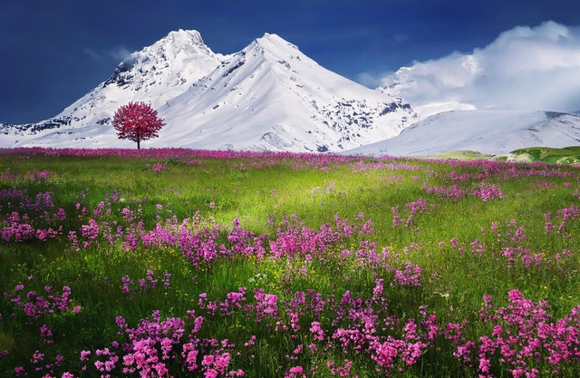

# Lab_2 

This is the simplified version of DLCV course HW2.

**What you will learn :**
- Color Segmentation
- Texture Segmentation
- Feature Descriptor
- Recognition with Bag of Visual Words


**Directory Tree**
```
|__Lab1
|  |__ Readme.md
|  |__ image/
|  |__ filterBank.mat
|  |__ mountain.jpg
|  |__ zebra.jpg
```

**Requirement**

You can only use the python packages below:

 - numpy
 - cv2 (opencv)
 - matplotlib
 - sklearn
 - scipy  ( only  for reading .mat file)

## 1. Color & Texture Segmentation

  
### Image data and filter banks
-	**filterBank.mat** :  The given .mat file contains a set of 38 filters. This filter bank is stored as a 49x49x38 matrix.
-	**Images** :  *zebra.jpg* and *mountain.jpg*

### Problems

1. **Color Segmentation** :    Given an RGB color image of size n = w × h pixels, each pixel can be viewed as a three dimensional feature. For this task, please run the **k-means** clustering algorithm* to cluster these n pixels (in terms of their 3D features) into k groups. 
(*Use k=10 and maximum number of iterations = 1000)

	**(a)**. Plot the segmentation results for both images based on your clustering results.For visualization purposes, pixels in the same group should be represented by the same color, while those in different groups are shown in distinct colors, as shown above. Some tips are shown in **hint 1** below. [<u>zebra_RGB.jpg</u>],[<u>mountain_RGB.jpg</u>]
	
	**(b)** Convert both RGB images into Lab color space. Repeat the above clustering procedure and plot your segmentation results.
	[<u>zebra-LAB.jpg</u>],[<u>mountain-LAB.jpg</u>]
	
2. **Texture Segmentation** :  We now consider the use of texture information for image segmentation. For simplicity, please convert the color images into **grayscale** ones, before extracting image textural features via the provided filter bank. As a result, you will produce n 38-dim features, each dimension corresponds to a particular filter response. Similarly, please perform **k-means** clustering* to cluster these n features into k different groups.  Some tips are shown in **hint 2**, **hint 3** below.
	(*Use k  = 6, maximum number of iterations = 1000 , and use **symmetric** padding to deal with image boundaries.) 
	
	**(a)** Plot the texture segmentation results.   [<u>zebra-tex.jpg</u>],[<u>mountain-tex.jpg</u>] 

	**(b)** Combine both color (**Lab** color space) and texture features (3+38 = 41-dim features) for image segmentation. Repeat the clustering procedure and plot your segmentation results. [<u>zebra-combine.jpg</u>],[<u>mountain-combine.jpg</u>]
	
	**hint 1**: How to plot the image after clustering?
	(1) Map the class number to any number between 0~255 (If the number are too near, the colors will be similar.)
	(2) `picture = cv2.applyColorMap( mapped image , cv2.COLORMAP_JET <- can change )`
	
	**hint 2**:  How to read and process the filterBank.mat ?
	(1) `scipy.io.loadmat( .mat file )` <- Be careful about the return type.
	(2) Because it contains 38  49x49 filters, you can use `np.transpose( array, (2,0,1) )`

	**hint 3**: How to padding?
	You can use `cv2.copyMakeBorder()`    

## 2. Recognition with Bag of Visual Words 
